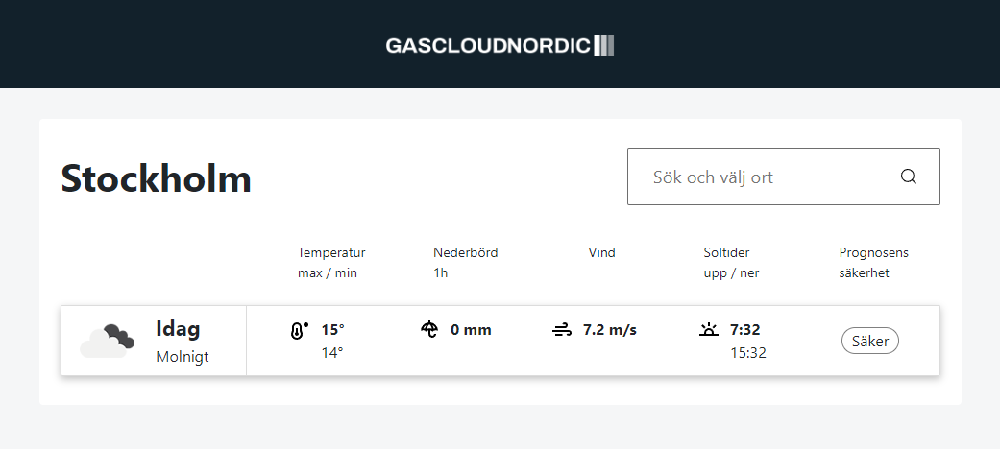

<!-- Improved compatibility of back to top link: See: https://github.com/othneildrew/Best-README-Template/pull/73 -->

<a name="readme-top"></a>

<!--
*** Thanks for checking out the Best-README-Template. If you have a suggestion
*** that would make this better, please fork the repo and create a pull request
*** or simply open an issue with the tag "enhancement".
*** Don't forget to give the project a star!
*** Thanks again! Now go create something AMAZING! :D
-->

<!-- PROJECT SHIELDS -->
<!--
*** I'm using markdown "reference style" links for readability.
*** Reference links are enclosed in brackets [ ] instead of parentheses ( ).
*** See the bottom of this document for the declaration of the reference variables
*** for contributors-url, forks-url, etc. This is an optional, concise syntax you may use.
*** https://www.markdownguide.org/basic-syntax/#reference-style-links
-->

[![Contributors][contributors-shield]][contributors-url]
[![Forks][forks-shield]][forks-url]
[![Stargazers][stars-shield]][stars-url]
[![Issues][issues-shield]][issues-url]
[![MIT License][license-shield]][license-url]
[![LinkedIn][linkedin-shield]][linkedin-url]

<!-- PROJECT LOGO -->
<br />
<div align="center">
  <a href="https://www.flaticon.com/free-icons/rain">
    
  </a>

<h3 align="center">AJAX Current Weather</h3>

  <p align="center">
    AJAX Current Weather fetches the current weather data for any given location. If no user input, location defaults to Stockholm, Sweden.
    <br />
    <br />
    <br />
    <!-- <a href="https://ajax-current-weather.netlify.app/">View Demo</a>
    · -->
    <a href="https://github.com/johnschatner/ajax-current-weather/issues">Report Bug</a>
    ·
    <a href="https://github.com/johnschatner/ajax-current-weather/issues">Request Feature</a>
  </p>
</div>

<!-- TABLE OF CONTENTS -->
<details>
  <summary>Table of Contents</summary>
  <ol>
    <li>
      <a href="#about-the-project">About The Project</a>
      <ul>
        <li><a href="#built-with">Built With</a></li>
      </ul>
    </li>
    <li>
      <a href="#getting-started">Getting Started</a>
      <ul>
        <li><a href="#prerequisites">Prerequisites</a></li>
        <li><a href="#installation">Installation</a></li>
      </ul>
    </li>
    <li><a href="#usage">Usage</a></li>
    <li><a href="#roadmap">Roadmap</a></li>
    <li><a href="#contributing">Contributing</a></li>
    <li><a href="#license">License</a></li>
    <li><a href="#contact">Contact</a></li>
    <li><a href="#acknowledgments">Acknowledgments</a></li>
  </ol>
</details>

<!-- ABOUT THE PROJECT -->

## About The Project

[](https://github.com/johnschatner/ajax-current-weather)

This project is a graded school examination to evaluate the alumnis competency in HTML, CSS and JS. The focus was specifically on JavaScript and API:s along with the XMLHttpRequest class. We were tasked with creating a static web page that would fetch the current weather for a hardcoded location.

1. Fetch and store the latitude and longitude coordinates for a given location using the OpenWeather GeoCoding API.
2. Fetch the temperature and weather description data for the given coordinates using OpenWeathe's Current weather data API.

I felt the urge to go a step further and expanded the app by

- User input for any location
- Modern UI
- Dynamic weather icon
- Min/max temperatures for the day
- Rainfall for past hour in mm
- Wind speed in m/s
- Sunrise/sunset times

<p align="right">(<a href="#readme-top">back to top</a>)</p>

### Built With


<p align="right">(<a href="#readme-top">back to top</a>)</p>

## Getting Started

To get a local copy up and running follow these simple steps.

### Installation

1. Clone the repo
   ```sh
   git clone https://github.com/johnschatner/react-digital-clock.git
   ```
2. Add API key inside `script.js` (replace config with your <a href="https://home.openweathermap.org/api_keys">key</a>)
   ```js
   const apiKey = yourKey;
   ```
3. Start a local development server
   ```sh
   npm run dev
   ```

<p align="right">(<a href="#readme-top">back to top</a>)</p>

<!-- USAGE EXAMPLES -->

## Usage

Get weather updates for your city so long as you provide the relevant api key from <a href="https://www.openweathermap.org">OpenWeatherMap</a>.

<!-- _For more examples, please refer to the [Documentation](https://example.com)_ -->

<p align="right">(<a href="#readme-top">back to top</a>)</p>

<!-- CONTRIBUTING -->

## Contributing

Contributions are what make the open source community such an amazing place to learn, inspire, and create. Any contributions you make are **greatly appreciated**.

If you have a suggestion that would make this better, please fork the repo and create a pull request. You can also simply open an issue with the tag "enhancement".
Don't forget to give the project a star! Thanks again!

1. Fork the Project
2. Create your Feature Branch (`git checkout -b feature/AmazingFeature`)
3. Commit your Changes (`git commit -m 'Add some AmazingFeature'`)
4. Push to the Branch (`git push origin feature/AmazingFeature`)
5. Open a Pull Request

<p align="right">(<a href="#readme-top">back to top</a>)</p>

<!-- LICENSE -->

## License

Distributed under the MIT License. See `LICENSE.txt` for more information.

<p align="right">(<a href="#readme-top">back to top</a>)</p>

<!-- MARKDOWN LINKS & IMAGES -->
<!-- https://www.markdownguide.org/basic-syntax/#reference-style-links -->

[contributors-shield]: https://img.shields.io/github/contributors/johnschatner/ajax-current-weather.svg?style=for-the-badge
[contributors-url]: https://github.com/johnschatner/ajax-current-weather/graphs/contributors
[forks-shield]: https://img.shields.io/github/forks/johnschatner/ajax-current-weather.svg?style=for-the-badge
[forks-url]: https://github.com/johnschatner/ajax-current-weather/network/members
[stars-shield]: https://img.shields.io/github/stars/johnschatner/ajax-current-weather.svg?style=for-the-badge
[stars-url]: https://github.com/johnschatner/ajax-current-weather/stargazers
[issues-shield]: https://img.shields.io/github/issues/johnschatner/ajax-current-weather.svg?style=for-the-badge
[issues-url]: https://github.com/johnschatner/ajax-current-weather/issues
[license-shield]: https://img.shields.io/github/license/johnschatner/ajax-current-weather.svg?style=for-the-badge
[license-url]: https://github.com/johnschatner/ajax-current-weather/blob/master/LICENSE.txt
[linkedin-shield]: https://img.shields.io/badge/-LinkedIn-black.svg?style=for-the-badge&logo=linkedin&colorB=555
[linkedin-url]: https://linkedin.com/in/linkedin_username
[product-screenshot]: images/screenshot.png
[next.js]: https://img.shields.io/badge/next.js-000000?style=for-the-badge&logo=nextdotjs&logoColor=white
[next-url]: https://nextjs.org/
[react.js]: https://img.shields.io/badge/React-20232A?style=for-the-badge&logo=react&logoColor=61DAFB
[react-url]: https://reactjs.org/
[vue.js]: https://img.shields.io/badge/Vue.js-35495E?style=for-the-badge&logo=vuedotjs&logoColor=4FC08D
[vue-url]: https://vuejs.org/
[angular.io]: https://img.shields.io/badge/Angular-DD0031?style=for-the-badge&logo=angular&logoColor=white
[angular-url]: https://angular.io/
[svelte.dev]: https://img.shields.io/badge/Svelte-4A4A55?style=for-the-badge&logo=svelte&logoColor=FF3E00
[svelte-url]: https://svelte.dev/
[laravel.com]: https://img.shields.io/badge/Laravel-FF2D20?style=for-the-badge&logo=laravel&logoColor=white
[laravel-url]: https://laravel.com
[bootstrap.com]: https://img.shields.io/badge/Bootstrap-563D7C?style=for-the-badge&logo=bootstrap&logoColor=white
[bootstrap-url]: https://getbootstrap.com
[jquery.com]: https://img.shields.io/badge/jQuery-0769AD?style=for-the-badge&logo=jquery&logoColor=white
[jquery-url]: https://jquery.com
